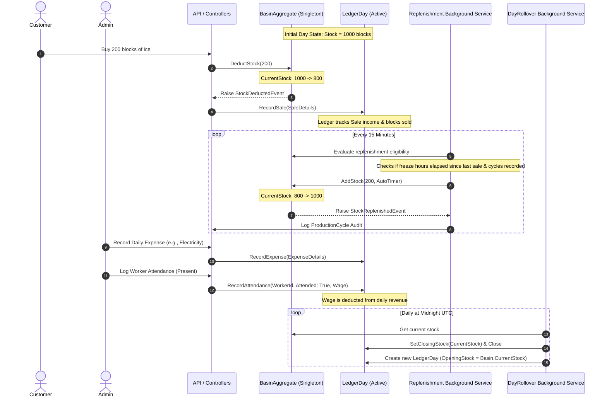

# IceFlow ERP — Enterprise Resource Planning & Industrial Automation Backend

[](https://dotnet.microsoft.com/)
[](https://www.microsoft.com/en-us/sql-server/)
[](#architecture--tech-stack)
[](#architecture--tech-stack)

An enterprise-grade, high-integrity backend system designed specifically for the ice manufacturing industry. Built with a **Modular Monolith** architecture using **.NET 9**, **Entity Framework Core**, and **SQL Server**, this system transitions traditional, manual, paper-based factory workflows into a fully automated, digitally audited operation.

---

## 📋 The Problem Statement

Industrial ice manufacturing facilities operate under highly specific physical and operational constraints that generic ERP or inventory solutions fail to address:

1. **Physical Ice Freezing Cycles**: Unlike standard warehouses where stock is static or instantly updated, ice production is a physical, time-bound chemical process. Water in large basins requires a set number of freezing hours to solidify into ice blocks. Stock replenishment must accurately model these time-based intervals rather than treating inventory as immediately available.
2. **Chaotic Logistical Flows**: Sales occur dynamically throughout the day, drawing from the active basin stock. In manual operations, recording sales, tracking real-time inventory, and predicting replenishment times is highly prone to human error, theft, and stock leakage.
3. **Daily Financial Reconciliation**: Because ice plant shifts often run 24/7, manual ledger keeping (اليومية) fails to accurately tie daily opening stock, sales, expenses, and closing stock, leading to unaccounted discrepancies.
4. **Labor-Intensive HR Management**: Factory workers operate in specialized physical roles (e.g., Winch Operators, Ice Pushers, Stakers) with daily cash wages. Manual tracking of attendance and instant wage disbursement leads to payroll friction and accounting mismatches.
5. **Multi-Partner Profit Splitting**: Facilities are often co-owned by partners who split profits based on fixed monthly equity percentages. Reconciling expenses, sales income, and computing precise dividends manually at the end of each month is time-consuming and vulnerable to calculation errors.

---

## 🚀 Core Features

### 1. Production & Basin Inventory Automation
* **Singleton Basin aggregate root** (`BasinAggregate`) encapsulating maximum capacity, freeze durations, and current stock level.
* **Auto-replenishment background processor** that monitors freeze cycles asynchronously and auto-replenishes active stock based on blocks sold, preventing double-replenishment in the same cycle.
* Fully audited production logs recording every automated freeze completion or manual stock override.

### 2. Daily Ledger System (اليومية)
* **Single-row-per-day ledger aggregate** (`LedgerDay`) locking in opening stock, recording day-specific sales and expenses, and calculating real-time daily profit.
* **Automatic Day Rollover Engine**: A background hosted service running at midnight UTC that closes the previous ledger day, sets its final closing stock, and carries the balance forward as the next day's opening stock.

### 3. Sales & Invoice Tracking
* Transactional records detailing blocks sold, unit prices (managed via custom `Money` value object), client names, and timestamps.
* Event-driven stock deduction triggered automatically on sale confirmation via domain events.

### 4. HR, Shifts & Attendance
* Worker registry detailing daily roles (e.g., Winch Operator, Ice Pusher, Staker) and standard daily wage rates.
* Daily attendance sheets linking workers to the current `LedgerDay`, with automatic daily wage calculation and direct cash ledger deductions for attended shifts.

### 5. Month-End Reporting & Profit Distribution
* Immutable monthly summaries generated upon closing the month, calculating aggregated income, expenses, and net profit.
* Automated equity-based profit splitting, generating partner-specific payout logs while mathematically validating that the sum of distributed percentages equals exactly 100%.

### 6. Deep Security Auditing
* SaveChanges interceptor that intercepts Entity Framework entity state transitions.
* Automatically serializes before/after entity states into JSON format and writes to a central `AuditLogs` table for total operational compliance and security.

---

## 🔄 Project Workflow (The Core Engine)

The following workflow models the physical operations of the factory, tracking the transition of physical states into transactional ledger records.



### Detailed Execution Steps

1. **Daily Initialization**: A `LedgerDay` is automatically active for the current calendar date. The active `BasinAggregate` tracks physical blocks available.
2. **Sales Dispatching**: When a sale is processed, the system atomically validates stock availability in the `BasinAggregate`. If validated, the stock is deducted, a `StockDeductedEvent` is dispatched, and a `Sale` entity is registered inside the active `LedgerDay`.
3. **Physical Freeze Simulation**: When sales occur, the last sale timestamp is recorded. The `ReplenishmentBackgroundService` evaluates the duration since this timestamp. If it equals or exceeds the basin's freeze cycle configuration, it replenishment-charges the basin up to capacity (or by the number of blocks sold) and writes an immutable audit record to the `ProductionCycles` table.
4. **Day Rollover Automation**: At midnight UTC, the `DayRolloverBackgroundService` closes the active ledger, calculating its total sales, total expenses, and attendance payouts. It sets the closing stock as the current active stock of the physical basin and initializes the next day's ledger.
5. **Month Closing & Split**: At month-end, the administrator executes the `CloseMonth` action, which aggregates all daily ledger metrics into a `MonthlySummary` and distributes the net profit among the registered partners based on their equity percentage.

---

## 🏗️ Architecture & Tech Stack

This project is built using a **Clean Architecture / Domain-Driven Design (DDD)** approach structured as a **Modular Monolith**:

```
IcePlant.sln
│
├── src/
│   ├── Shared/
│   │   ├── Domain/                 # Enterprise Domain Commons, Value Objects, Shared Events
│   │   ├── Application/            # Shared Application Abstractions & Interfaces
│   │   ├── Infrastructure/         # DB Context, Interceptors, Shared Background Services
│   │   └── API/                    # Shared API Middlewares and Common Routing
│   │
│   └── Modules/
│       ├── Auth/                   # Identity User & Role Administration (JWT tokens)
│       ├── Inventory/              # Basins, Production Cycles, Freeze Timers
│       ├── Sales/                  # Customer Order Registers & Invoices
│       ├── HR/                     # Worker Rosters, attendance, & Wage calculations
│       ├── Finance/                # Daily Ledgers, Expenses, Categories
│       └── Reports/                # Monthly Summaries, Partner Profit Splits
```

### Technical Highlights
* **Strict Aggregates & Encapsulation**: All state transitions must go through aggregate roots (`BasinAggregate`, `LedgerDay`, `MonthlySummary`). Entities feature private parameterless constructors for EF Core and internal state changes are performed strictly via command methods.
* **Separation of Concerns**: Each module functions as a mini-bounded-context with its own domain models, repository implementations, application logic, and controllers.
* **Rich Domain Events**: In-memory domain event dispatching is used to synchronize status changes across aggregates in different contexts during a single unit of work transaction.
* **Value Objects**: Domain concepts like currency and percentage are modeled as rich, self-validating value objects (`Money` and `SplitPercentage`) to prevent primitive obsession.

---

## 📊 Database Schema Overview

The database is powered by **SQL Server** and managed using **Entity Framework Core** migration scripts. Below is the relational structure of the core database tables:

```
                  +-------------------+
                  |   AspNetUsers     |
                  +-------------------+
                            |
                            | (Performs changes)
                            v
                  +-------------------+
                  |    AuditLogs      |
                  +-------------------+

+-------------------------------------------------------+
|                    FINANCIAL SYSTEM                   |
|                                                       |
|  +---------------+             +-------------------+  |
|  |  LedgerDays   |<----------- |   ProductionCycles|  |
|  +---------------+             +-------------------+  |
|    |           |                                      |
|    | (1)       | (1)                                  |
|    v (N)       v (N)                                  |
|  +-------+   +----------+      +-------------------+  |
|  | Sales |   | Expenses |<---- | ExpenseCategories |  |
|  +-------+   +----------+ (N)  +-------------------+  |
|                (1)                                    |
+-------------------------------------------------------+
     |                               ^
     | (Triggers stock deduction)    | (Deducts wages)
     v                               |
+------------------+                 |
|  Basins (Stock)  |                 |
+------------------+                 |
                                     |
+------------------------------------+------------------+
|                      HR SYSTEM                        |
|                                                       |
|  +-------------------+         +-------------------+  |
|  |  DailyAttendances |-------->|     Workers       |  |
|  +-------------------+ (N)  (1)+-------------------+  |
+-------------------------------------------------------+

+-------------------------------------------------------+
|                    REPORTING SYSTEM                   |
|                                                       |
|  +-------------------+         +-------------------+  |
|  |  MonthlySummaries |<--------|    ProfitSplits   |  |
|  +-------------------+ (1)  (N)+-------------------+  |
+-------------------------------------------------------+
```

### Table Definitions & Relationships

1. **`Basins`** (Inventory Module)
   * Holds the singleton physical basin state (ID = 1).
   * Schema: `Id (PK)`, `CurrentStock (int)`, `MaxCapacity (int)`, `FreezeHours (double)`, `LastUpdatedAt (datetime)`.
2. **`LedgerDays`** (Finance Module)
   * Tracks daily physical/financial totals. Parent to sales and expenses.
   * Schema: `Id (PK)`, `DayDate (date, Unique)`, `OpeningStock (int)`, `ClosingStock (int)`, `Notes (nvarchar)`, `CreatedAt (datetime)`.
3. **`Sales`** (Sales Module)
   * Records sales transactions. Foreign key to `LedgerDays`.
   * Schema: `Id (PK)`, `LedgerDayId (FK)`, `SaleTime (datetime)`, `BlocksSold (int)`, `UnitPrice_Amount (decimal)`, `TotalAmount_Amount (decimal)`, `CustomerName (nvarchar)`, `Notes (nvarchar)`.
4. **`Expenses`** & **`ExpenseCategories`** (Finance Module)
   * Tracks business expenses. Foreign key to `LedgerDays` and `ExpenseCategories`.
   * Schema: `Id (PK)`, `LedgerDayId (FK)`, `CategoryId (FK)`, `Amount_Amount (decimal)`, `ExpenseTime (datetime)`, `Supplier (nvarchar)`, `InvoiceRef (nvarchar)`, `Notes (nvarchar)`.
5. **`Workers`** & **`DailyAttendances`** (HR Module)
   * Tracks daily shifts and automated payroll.
   * Schema: `Worker` -> `Id (PK)`, `FullName (nvarchar)`, `Role (int)`, `DailyWage_Amount (decimal)`, `IsActive (bit)`, `HiredAt (date)`.
   * Schema: `DailyAttendance` -> `Id (PK)`, `LedgerDayId (FK)`, `WorkerId (FK)`, `Attended (bit)`, `WagePaid_Amount (decimal)`, `Notes (nvarchar)`.
6. **`MonthlySummaries`** & **`ProfitSplits`** (Reports Module)
   * Handles profit splits and archives month-end results.
   * Schema: `MonthlySummary` -> `Id (PK)`, `MonthYear (date)`, `Year (int)`, `Month (int)`, `TotalIncome_Amount (decimal)`, `TotalExpenses_Amount (decimal)`, `NetProfit_Amount (decimal)`, `IsClosed (bit)`, `ClosedAt (datetime)`.
   * Schema: `ProfitSplit` -> `Id (PK)`, `MonthlySummaryId (FK)`, `PartnerName (nvarchar)`, `SplitPercentage_Value (decimal)`, `AmountReceived_Amount (decimal)`.

---

## 🔮 Future Roadmap

* **IoT Telemetry Integration**: Replace the timer-based background simulation with direct physical telemetry, connecting IoT weight and temperature sensors from the freezing basins to trigger real-time stock replenishment events in the API.
* **Microservices Split**: Extract highly utilized contexts (such as the Sales and Basin Inventory modules) into independent microservices communicating over an asynchronous message broker (e.g., RabbitMQ or Azure Service Bus) to handle multiple ice plant locations.
* **Predictive Stock Analytics**: Incorporate Machine Learning models to analyze historic sales ledger logs and forecast peak ice demand based on historical temperatures and weather forecasts, dynamically adjusting freeze durations and replenishment thresholds.
* **Cloud Native Infrastructure**: Migrate to Dockerized container deployments orchestrated by Kubernetes on Azure (AKS) with automated GitHub Actions workflows for continuous integration and zero-downtime rolling updates.
